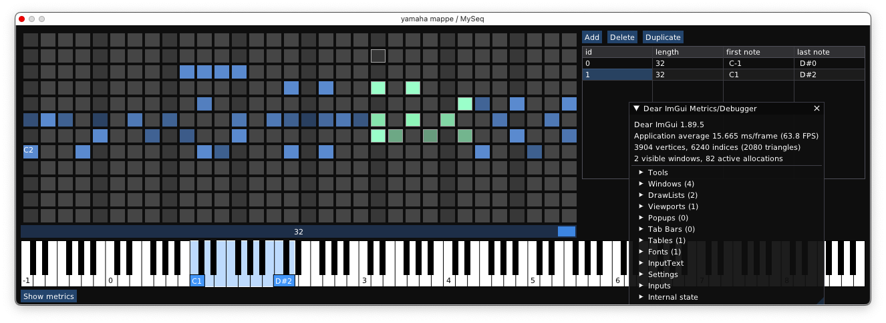

MIDI sequencer plugin based on DPF framework 
Few things that are missing from being usable in non-dev setting:
- Safer asserts. As this is in early development, any data inconsistency is handled by crashing
- Even though this does have all major UI features, they are not calibrated to provide smooth experience

Ever-growing list of work in progress is in TODO.md

